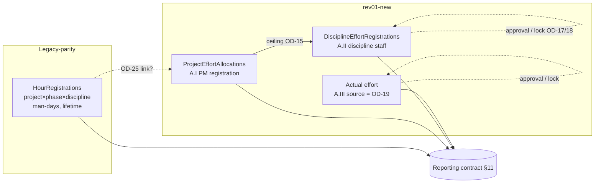
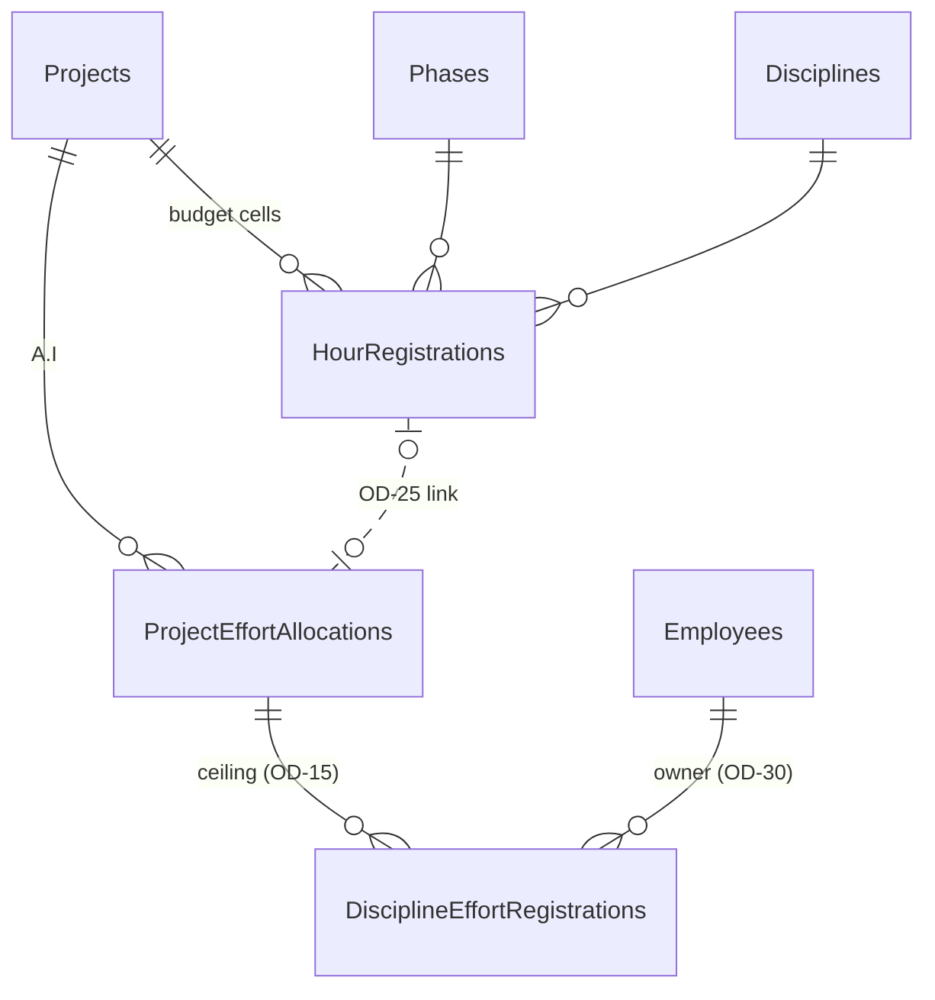

# Design — R3 Planning & Effort (Open Spec, NOT APPROVED)

## 1. Context

- Platform (unchanged, proven in R1/R2): SharePoint Online lists (OPS site) as the only application store; Power Apps
  Canvas; Power Automate guarded flows (standard connectors) running as the service identity; Entra security groups as
  roles; trusted identity resolved server-side; AuditLog append-only; ETag (`If-Match`) concurrency; no Dataverse, no
  Premium connectors; service rights View/Add/Edit only (D-7: no Delete, soft delete only).
- Reusable R1/R2 patterns: guard capability + scope check (`docs/authorization-guard.md`); per-row results and PARTIAL
  outcome (TS-Approve); typed refusals `MSG_<code>`; `AUDIT_DEGRADED` (AUD-F1 option B); correlation id = flow run name;
  optional V2 trigger inputs passed by trigger key; Canvas never binds protected lists.
- Evidence base: legacy Hour Registration analysis (39 behaviours, `traceability.md` §2) and the requirement / decision
  inventory (14 NR-EFF plus the reviewed decision register in `decisions.md`). EFF-F-1..7, 9 and 10 remain open; EFF-F-8 is RESOLVED_BY_EVIDENCE as deferred for the current scope (OD-21).

## 2. Goals / Non-Goals

**Goals:** a reviewable, testable specification for S12.5, EPIC 16 and EPIC 17 that (1) keeps legacy behaviour where it is
a business rule, (2) fixes documented legacy defects, (3) never guesses an undecided rule, (4) reuses the proven guarded
architecture, (5) defines the data contract later reporting needs.

**Non-Goals:** implementation, provisioning, flows, app versions, migration runs, EPIC 18 analytics, KPI, evaluation,
salary review, bonus, salary-cost figures, resource evaluation formula, Production, EPIC 07 fixture cleanup.

## 3. Concept boundary (evidence-driven)

| Concept | Source | Grain (evidence) | Status | Model in this spec |
|---|---|---|---|---|
| **Legacy Hour Registration** (E14, "Công đăng ký cho dự án") | Legacy screen + data | project × phase × discipline, man-days, lifetime, no workflow | Legacy, verified | Entity `HourRegistrations` |
| **Project effort registration** (rev01 A.I, NR-EFF-01) | Customer document | project × recipient (Quản lý phòng, PM, disciplines); phase / period UNKNOWN | New, rules open | Candidate entity `ProjectEffortAllocations` |
| **Discipline effort registration** (A.II, NR-EFF-02..04) | Customer document | project × discipline × task (phase or work type, OD-29) × person? (OD-30) | New, rules open | Candidate entity `DisciplineEffortRegistrations` |
| **Actual effort** (A.III, NR-EFF-05/06) | Customer document | UNKNOWN (OD-19) | New, rules open | Options in §10 |

**Decision of this spec:** the three are **not collapsed**. Shared name, actor and discipline columns link legacy E14
and A.I, but rev01 is classified as a new requirement and adds workflow legacy never had. OD-25 decides whether A.I
replaces, extends or is seeded from E14; until then S12.5 is specified as the legacy budget matrix and A.I as a separate
candidate entity with an explicit, optional link (`design.md` §5.2 `SourceRegistration`).



## 4. Business process model and states

States below are derived from the document wording only ("đăng ký", "phê duyệt", "khóa"); where the document is silent
the transition is an OPEN_DECISION and is shown dashed.

### 4.1 S12.5 Hour Registration (legacy): **no workflow states** (legacy WF-04: no status, no lock). Each cell is
BLANK or VALUE. Operations: set value, clear. Proposed target adds no state (adding approval would invent workflow).

### 4.2 Project effort (A.I)

| Transition | Actor | Precondition | Operation | Server-side authorization | Result | Audit | Editable after | Concurrency | Failure |
|---|---|---|---|---|---|---|---|---|---|
| create / change allocation | PM (OD-24) | project editable, unit/period/source decisions closed | EFF-SaveProjectAllocation | `EFF.ProjectEdit` + project scope (OD-24) | allocation value set and effective immediately | WriteProxy per changed value | yes; no A.I approval state in current scope | ETag per item | typed refusal, no write |

### 4.3 Discipline effort (A.II) and actual effort (A.III)

```mermaid
stateDiagram-v2
  [*] --> Draft: register (scope per OD-30)
  Draft --> Draft: change / clear (ETag; ceiling per OD-15)
  Draft --> Approved: Chủ trì approves = lock (OD-17; self rule OD-28)
  Approved --> Draft: reopen ONLY IF OD-18 defines it (disabled; no flow, no event)
```

Note: the document says "Người phê duyệt: Chủ trì => khóa" — approval **implies** lock. The spec therefore models one
state `Approved` that is immutable (Approved ≡ locked); there is **no** separate `Locked` state and no separate Lock
event (planning-audit). The `Approved → Draft` edge exists only if OD-18 defines a reopen path; until then it is
disabled (no flow, no capability, no Unlock event).

| Transition | Actor | Precondition | Server-side authorization | Result | Audit | Editable after | Concurrency | Failure |
|---|---|---|---|---|---|---|---|---|
| register | discipline staff / Chủ trì | own discipline; registration open (OD-23); ceiling not exceeded (OD-15) | `EFF.DisciplineEdit`, scope = trusted caller discipline; ownership grain follows OD-30 (per-person owner resolved server-side if that option is chosen; no client owner claim trusted) | Draft | WriteProxy | according to OD-30 while Draft | ETag; ceiling check re-read at write | VALIDATION_* / OVER_CEILING / CONFLICT |
| change / clear | owner | Draft | same; Approved → LOCKED | Draft | WriteProxy | – | ETag | LOCKED / CONFLICT |
| approve (lock) | Chủ trì (OD-17) | Draft; self-approval condition follows OD-28; order rule (OD-27) | `EFF.DisciplineApprove`, discipline scope | Approved (immutable / locked) | exactly one Approval business event recording resulting locked state | none (all roles) | ETag | ROLE_NOT_ALLOWED / SCOPE_NOT_ALLOWED / CONFLICT |
| unlock / reopen | OPEN (OD-18) | – | `EFF.Unlock` (not seeded) | – | `Unlock` (disabled) | – | – | UNKNOWN_ACTION until decided |
| actual effort register / approve | per OD-19 | – | – | – | – | – | – | – |

## 5. Data model (candidates; nothing provisioned)

Common columns on every planning list (R1 pattern): `OwnerUpn` where a row has a person owner (indexed); `ActorUpn`
(last trusted writer); `CorrelationId`; `Status` (`Active` / `Deleted` soft delete per D-7, or the workflow state);
`LegacyId` where migrated; SharePoint `Created/Author/Modified/Editor` = service (metadata only, never authorisation
keys); ETag = SharePoint `odata.etag`; version history on.

### 5.1 `HourRegistrations` (S12.5) — revised from the current target design

| Column | Type | Req | Idx | Unique | Rule |
|---|---|---|---|---|---|
| `RegKey` | SL | Y | Y | **Y** | `<ProjectLegacyId>\|<PhaseLegacyId>\|<DisciplineLegacyId>` using immutable environment-portable master `LegacyId` values; SharePoint ItemIds are local lookup/query ids only (LHR-06) |
| `Project` / `ProjectItemId` | LU → Projects / Num | Y | **Y** (ItemId) | N | |
| `Phase` / `PhaseItemId` | LU → Phases / Num | Y | N | N | allowed phase set follows OD-02; if legacy-parity option is approved, phase must belong to the project's phase list |
| `Discipline` / `DisciplineItemId` | LU → Disciplines / Num | Y | N | N | |
| `ManDays` | Number (decimals per OD-03) | **N** | N | N | blank/zero storage follows OD-01; option (a) uses null = BLANK and 0 = explicit VALUE 0 |
| `Status` | Choice `Active` | Y | N | N | no workflow (§4.1); `Deleted` only if a project deletion rule requires it (OD-08/09) |
| `ActorUpn`, `CorrelationId` | SL | – | N | N | trusted writer; run id |
| `LegacyId` | SL | Y | Y | **Y** | immutable row identifier generated for every target item; migration may derive it deterministically from the canonical `RegKey` for repeatable loads |

- Unpivoted storage is fixed; physical clear semantics follow OD-09. If OD-09 option (a) is approved, one item is retained per cell that has ever held a value and clearing sets `ManDays = null` (no Delete right needed, history kept in versions and audit). Other OD-09 options require this row to be re-baselined before implementation.
- Volume: legacy source has 199 filled cells; migrated target item count is conditional on OD-01/09. Growth ≈ 200 projects × ≤ 13 phases × ≤ 6 disciplines worst case ≈ 15,600, realistic
  ≈ 1–3k. Query pattern: `ProjectItemId eq <n>` (indexed) → ≤ 78 items per project.

### 5.2 Candidate EPIC 16 / 17 entities (shape depends on decisions; columns marked † are decision-dependent)

| Entity | Purpose | Business key (candidate) | Key columns | State | Volume (est.) |
|---|---|---|---|---|---|
| `ProjectEffortAllocations` | A.I PM registration (NR-EFF-01) | Project + RecipientCategory + Phase† + Period† | `RecipientCategory` (Choice: QuanLyPhong / PM / Discipline), `DisciplineItemId`†, `PhaseItemId`† (OD-22), `PeriodKey`† (OD-23), `Effort` (unit OD-14; blank/zero OD-40), `SourceRegistration`† (link to `HourRegistrations`, OD-25), `SourceRef`† (allocation table, OD-16). OD-31 maps QuanLyPhong to later reporting visibility, not A.I storage | no approval state in current scope (resolved OD-26) | ≈ 200 projects × ≤ 6 recipients × periods |
| `DisciplineEffortRegistrations` | A.II discipline registration (NR-EFF-02..04) | Project + Discipline + Task† + Owner† + Period† | `TaskType`/`TaskItemId`† (OD-29), `OwnerUpn`/`EmployeeItemId`† (OD-30), `Effort`, `Status` Draft/Approved, `ApprovedBy` (Text UPN), `ApprovedOn` (UTC) — same conventions as EPIC 07 | Draft → Approved (locked) | ≈ staff (≈ 120) × active projects × periods: ≈ 5–30k/yr† |
| `ActualEffortEntries` (only if OD-19 = separate) | A.III actual effort | Project + Owner + Date/Period† | as above + `Status`, `ApprovedBy/On` | Draft → Approved | similar to TimesheetEntries (≈ 10–15k/yr) |

Ceiling (OD-15) is computed, not stored: Σ `DisciplineEffortRegistrations.Effort` (non-deleted, scope per OD-15) ≤ the
matching `ProjectEffortAllocations.Effort`. If concurrency of the sum must be guaranteed, a per-scope **counter item**
with ETag (`EffortCeilingCounters`, key = ceiling scope) is the candidate (see §9.3).



Retention: planning data kept for the project lifetime + the company's record retention (not decided; non-blocking).
Soft delete only (D-7). No hard delete by any service.

## 6. SharePoint suitability

| Check | `HourRegistrations` | EPIC 16/17 candidates |
|---|---|---|
| 5,000 list-view threshold | < 16k worst case; every query filters an indexed `ProjectItemId` first | Index `ProjectItemId`, `DisciplineItemId`/`OwnerUpn`, `PeriodKey`†; filters always start with an indexed column; keyset paging (`Id gt`) as TS-ReadTeam |
| Delegation | Canvas never queries the list; flows return ≤ 78 cells per project | flows page ≤ 500 |
| Lookups per list | 3 (≤ 12 limit) | ≤ 5 |
| Indexes | `RegKey` (unique), `ProjectItemId`, `LegacyId` (unique) | ≤ 6 each (limit 20) |
| Batch | sequential MERGE/POST per changed cell, ≤ 100 REG cells per Save call (covers current 13 × 6 = 78 design); no `$batch` | EPIC17 approval may retain ≤ 50 items per approval call |
| Growth | small | moderate; within thresholds with indexed filters |
| Power BI | reads via service/report identity, unpivoted rows are star-schema ready | same |
| Version history | on (audit of values) | on |
| Permissions | list-level protected: service TS Service (View/Add/Edit); ordinary users have no direct read/write; guarded flows mediate authorised access; no item-level unique permissions | same |

SharePoint is suitable: small volumes, keyed access, no cross-list transactions needed except the ceiling (handled by
§9.3). No item-level permissions are proposed.

## 7. Power Apps UX (specification, not built)

### 7.1 Hour Registration (S12.5)
- **Navigation:** Time Sheet / Planning group → "Đăng ký công" (LHR-01); hidden when the server refuses `REG.View`
  (same silent-hide pattern as the EPIC 07 pending count).
- **Selection:** year filter (All + years present in Projects, LHR-03), single searchable project picker showing
  code — name, keyed by project id (LHR-05/06); empty filter result clears the grid (LHR-04).
- **Matrix:** row source follows OD-02; if legacy parity is approved, rows = the project's phases in project order. STT, phase name and code are read-only (LHR-11);
  columns are dynamic and ordered by SortOrder; active/editable vs inactive/stale discipline/phase presentation follows OD-08 and SHALL NOT silently discard stored values. Under OD-08 option (a), stale/inactive values are shown read-only and flagged. Built as nested galleries over a local collection loaded from `REG-ReadMatrix`.
- **Cell states:** exact BLANK/zero semantics follow OD-01. Under option (a): BLANK (empty input, placeholder "—"), VALUE (number, including explicit 0 shown as "0"), DIRTY and ERROR; under option (b), UI/storage follow the approved legacy-coercion rule.
- **Editing:** numeric input per OD-03; inline validation message; clear = empty input or a clear (×) button per cell;
  "clear row" optional (OD-10).
- **Save:** enabled only with a selected project, ≥ 1 dirty cell and no invalid cell (LHR-20); sends only dirty cells
  with their load ETags; shows a per-cell result list; success toast with correlation id; conflicts reload the affected
  cells and keep the user's other edits marked dirty.
- **Dirty state:** leaving the screen or switching project with dirty cells asks for confirmation (LHR-19).
- **Read-only mode:** when the server refuses `REG.Edit` on save-capability probe (read response flag
  `canEdit=false`), inputs are view-mode, Save hidden (LHR-24); the server still refuses writes.
- **Loading / error:** busy indicator; typed error messages (`MSG_*`); empty project → explanatory empty state.
- **Large matrix:** current capacity target is 13 × 6 = 78 editable cells, which fits the 100-change Save cap. Discipline count remains dynamic; a future matrix that can exceed 100 changed cells requires a spec re-baseline rather than silent client-side Save splitting.
- **Accessibility:** every input has an accessible label "<phase> / <discipline>"; error text, not colour only;
  keyboard tab order row-major; touch targets ≥ 40 px.
- **Responsive:** tablet / desktop layout; phone shows one phase at a time (row card with discipline inputs).

### 7.2 EPIC 16 / 17 journeys (proposed; screens follow decisions)
1. **PM — project allocation (A.I):** pick project → allocation grid (recipients × phase†/period†) → save (same
   changed-cell pattern) → effective immediately after a successful guarded save (resolved OD-26: no A.I approval workflow in current scope).
2. **Discipline staff — registration (A.II):** pick project → my discipline's registrations → add task row (OD-29) →
   effort → save; ceiling remaining shown from the server (never computed client-side).
3. **Chủ trì — approval (A.II / A.III):** queue of Draft registrations in scope (pattern of the EPIC 07 Team approval
   queue: Pending / Approved modes, lock icon, per-row results) → approve (per row or selection; batch rule by analogy
   with B-02 to be confirmed) → locked.
4. **Actual effort (A.III):** per OD-19 — either "no new screen, uses the timesheet" or a registration screen like (2).

## 8. Power Automate contracts (proposed; names follow the existing `TS-*` pattern with a `REG-` / `EFF-` prefix)

All flows: Power Apps V2 trigger; trusted caller via Office 365 Users `MyProfile_V2`; identity → Employees row; guard
(capability + scope); configuration from AppSettings; mandatory `AuthorizationAllow/Deny` audit before any read/write;
service-identity writes; `retryPolicy: none` on writes; response `ok, resultcode, messagecode, correlationid, …`;
client decoys (`OwnerUpn, Role, Scope, DisciplineCode, ProjectItemId-as-claim, ApprovedBy, Status`) logged by name only.

| Flow | Purpose | Inputs | Authorization | Validation | Reads / writes | Concurrency / batch | Replay safety / dedup | Audit | Response | Typed errors |
|---|---|---|---|---|---|---|---|---|---|---|
| `REG-ReadMatrix` | load one project's matrix | `ProjectItemId` | `REG.View` (scope per OD-05/06) | project exists, listed per OD-07 | read Projects (phase list), Phases, Disciplines, HourRegistrations (`ProjectItemId eq`) | – | read-only | AuthorizationAllow/Deny + ReadProxy | `phases[]`, `disciplines[]`, `cells[] {phaseId, disciplineId, state: BLANK\|VALUE, value, etag}`, `canEdit`, `stale[]` | ROLE_NOT_ALLOWED, NOT_FOUND, VALIDATION_LOOKUP |
| `REG-SaveMatrix` | save changed cells | `ProjectItemId`, `Changes` JSON `[{phaseId, disciplineId, state, value, etag}]` (1–100), `ClientRequestId` | `REG.Edit` | preflight **all** cells before any write: phase allowed by OD-02, discipline allowed by OD-08/current master state, value domain (OD-03), project editable (OD-07), no duplicate key in request, ETag matches current (or "new" when no item); server resolves stable Project/Phase/Discipline LegacyIds before constructing `RegKey` | per cell: POST new item (unique `RegKey`) or MERGE `ManDays` with `If-Match` | §9 | `ClientRequestId` is correlation only; state equality may return `NO_CHANGE`; stale ETag returns `CONFLICT`; unique RegKey prevents duplicate cell items | WriteProxy per committed changed cell (Create / Update / Clear) | `resultcode` OK / PARTIAL / REFUSED, `results[] {phaseId, disciplineId, resultcode, etag}` | VALIDATION_REQUEST, VALIDATION_VALUE, CONFLICT, LOCKED (n/a for S12.5), ROLE_NOT_ALLOWED |
| `EFF-ReadProjectAllocation` / `EFF-SaveProjectAllocation` | A.I | analogous | `EFF.ProjectView` / `EFF.ProjectEdit` + project scope (OD-24) | unit/period/phase/source/blank-zero per OD-14/22/23/16/40 | `ProjectEffortAllocations` | §9 | same replay-safe model; no request-id exactly-once claim | WriteProxy | same shape | + OUT_OF_PERIOD |
| `EFF-ReadDisciplineEffort` | own / discipline / queue modes | `ProjectItemId`, `Mode` | `EFF.DisciplineView` | – | `DisciplineEffortRegistrations` | paging ≤ 500 | – | ReadProxy | rows + `remainingCeiling` | – |
| `EFF-SaveDisciplineEffort` | register / change / clear Draft | changes JSON | `EFF.DisciplineEdit`, discipline scope; ownership grain/resolution per OD-30 | ceiling (OD-15), period open (OD-23), Draft only | same | §9.3 counter | replay-safe semantics per §9.4 | WriteProxy | per row | OVER_CEILING, LOCKED, CONFLICT |
| `EFF-ApproveDisciplineEffort` | Chủ trì approve = lock | items `{itemId, etag}` 1–50 | `EFF.DisciplineApprove`, discipline scope (OD-17); self-approval rule per OD-28 | Draft; order (OD-27) | MERGE Status/ApprovedBy/ApprovedOn | per row (TS-Approve pattern) | ETag | exactly one Approval business event per approved row; locked state recorded in event/result | per row | ROLE_NOT_ALLOWED, SCOPE_NOT_ALLOWED, LOCKED, CONFLICT |
| `EFF-UnlockDisciplineEffort` | **not specified until OD-18** | – | `EFF.Unlock` | – | – | – | – | Unlock (disabled) | – | UNKNOWN_ACTION |
| actual effort flows | per OD-19 | – | – | – | – | – | – | – | – | – |

Retry policy: client never auto-retries a write; flows use `retryPolicy: none` on writes (R1 precedent). Partial
success is reported per item and is never hidden behind a success message.

## 9. Batch and concurrency

### 9.1 Changed-cell detection
The client keeps the loaded snapshot (`state`, `value`, `etag`) per cell; a cell is changed when `state` or `value`
differs from the snapshot. Only changed cells are sent. Never a whole-table overwrite.

### 9.2 Atomicity and partial failure
SharePoint has no multi-item transaction. Design (technical, not a business rule; chosen to keep the legacy
all-or-nothing outcome of one Save as far as the platform allows, LHR-18): **preflight all-or-nothing** — authorization,
validation and an ETag re-read of every target before the first write. Any preflight refusal, **including a stale ETag
found at preflight**, → overall `REFUSED`, nothing written; the stale cells carry per-cell `CONFLICT`, all other cells
`NOT_WRITTEN`. Then **per-cell writes**. Only a failure that occurs **after** preflight (a 412 race between preflight and
the cell's write, or a 5xx) marks that cell `CONFLICT`/`ERROR`, continues with the others, and returns `PARTIAL` +
`WARN_RELOAD_REQUIRED` with committed and failed cells identified. The UI reloads the matrix and keeps unsaved user values marked dirty.
For `REG-SaveMatrix`, one user Save SHALL be one guarded flow call of 1–100 changed cells. The current designed maximum matrix is 13 × 6 = 78 cells, so a full-matrix change fits in one call and cannot be partially committed merely because the client split the Save. If a future matrix can exceed 100 changed cells, the UI SHALL refuse the Save with a typed size error until a new transaction strategy is specified; it SHALL NOT silently split one user Save into multiple independent commits.

### 9.3 ETag and creation races
- Existing cell: ETag re-checked at preflight (stale → whole request `REFUSED`, §9.2); the MERGE also sends `If-Match`, so
  a change that lands between preflight and write → that cell `CONFLICT`, request `PARTIAL`.
- New cell: preflight confirms no item exists for the `RegKey`; POST is guarded by the unique `RegKey`, so a concurrent
  creator between preflight and write → that cell `CONFLICT`, request `PARTIAL`.
- Concurrent editors on **different** cells: both succeed (no ETag overlap). **Same** cell: the second Save, submitted
  after the first committed, is `REFUSED` at preflight with that cell `CONFLICT` and nothing written; the user reloads
  and re-applies.
- Ceiling (EPIC 17): the sum check is racy across items; candidate mitigation = per-scope counter item updated with
  `If-Match` in the same flow before writing the registration (counter conflict → retry-free `CONFLICT`). Exact scope
  depends on OD-15.

### 9.4 Replay safety (not true request-id idempotency)
`ClientRequestId` is a correlation value only; it is **not** a persisted deduplication key in this design. A resubmitted request may return `NO_CHANGE` when current state already equals the requested state, or `CONFLICT` when its ETag is stale. Unique canonical keys prevent duplicate cell items. The implementation SHALL NOT claim exactly-once request-id idempotency unless a future design persists request outcomes keyed by `ClientRequestId`.

### 9.5 Blank / zero / decimal round-trip
Wire/storage semantics follow OD-01. If option (a) is approved, wire format per cell is `state` ∈ {`BLANK`, `VALUE`}, `value` is a JSON number only when `VALUE`, storage uses `ManDays = null` vs number, and Canvas distinguishes empty input from explicit `0`. If option (b) is approved, the contract is re-baselined to the approved legacy-coercion semantics before implementation. Decimal parsing follows OD-03.

## 10. Actual effort source (OD-19) — options and downstream effect

| Option | Description | Data model | Approval / lock | EPIC 07 interaction | Reporting | Effort |
|---|---|---|---|---|---|---|
| A. Timesheet-derived | actual = Σ TimesheetEntries hours × factor / `HoursPerManDay` per project (and phase) | none new | rev01 "Chủ trì lock" maps to EPIC 07 approval (TL own discipline = Chủ trì?) → only consistent if OD-17 = Team Leader; Approved-only vs all per OD-33 | reuses EPIC 07 lock; per-project Chủ trì would need a new approval scope (conflict with G5) | direct from TimesheetEntries | low |
| B. Separate registration | staff register actual effort per project / period in `ActualEffortEntries` | new list + flows | own Draft → Chủ trì approve/lock (§4.3) | duplicate data entry with timesheets; reconciliation needed | new fact | high |
| C. Hybrid | timesheet hours as default, Chủ trì confirms a per-project actual snapshot | new snapshot list | approval of the snapshot | none on timesheet rows | snapshot fact | medium |

No option is chosen here.

## 11. Reporting data contract (EPIC 18 boundary — contract only)

| Fact (grain) | Measure | Keys | Source | Filters |
|---|---|---|---|---|
| Registered budget (legacy) | `ManDays` — storage, aggregation and display semantics follow OD-01: **IF (a)** blank (null) and explicit 0 stay distinct in storage and display, sums treat blank as 0, "registered cell" counts exclude blank and include explicit 0; **IF (b)** the approved legacy coercion applies (0 and blank equivalent) and counts follow that rule | Project, Phase, Discipline | HourRegistrations | Status Active; stale rows per OD-08 |
| Planned project effort | `Effort` in OD-14 source unit | Project, RecipientCategory, Phase†, Period† | ProjectEffortAllocations | successful guarded saves (no A.I approval in current scope) |
| Discipline registered effort | `Effort` | Project, Discipline, Task†, Owner†, Period† | DisciplineEffortRegistrations | Draft / Approved flag exposed |
| Actual effort | source unit per OD-19/OD-14 | Project, Phase†, Discipline (snapshot OD-35), Owner†, Date/Period† | per OD-19 | EntryStatus per OD-33; ownership per existing Timesheet rules or OD-41 |
| Variance | normalised planned − actual | common approved keys | derived later | explicit comparison-unit conversion; source facts unchanged |

Rules: legacy HourRegistration source remains man-days; new EFF source unit follows OD-14. A later comparison normalises explicitly (for example via `HoursPerManDay`) instead of changing source storage. Period/lifetime presentation follows approved period decisions. Whether budget/planned rows with no actuals are shown follows OD-13; R3 preserves independent facts for either option. No salary, rate or cost column exists in the R3 contract; no KPI/evaluation input.

## 12. Migration

- **S12.5:** legacy E14 = 20 project files (+ an empty temp file), 94 lines, 470 cells: 199 filled (195 non-zero,
  4 zero) and 271 blank; Σ 8,648 man-days; integers 2–200; no decimals, negatives, text, duplicates or unknown
  phase/discipline ids; one orphan file (deleted project, 9 lines, all blank → excluded, 0 values lost; corrects the
  earlier "45 orphan cells" note); one stale line (phase no longer on the project, OD-08); 3 duplicate project codes
  (16 projects) → key by project id (LHR-06). Proposal: unpivot according to the approved OD-01 + OD-09 mapping. If blank≠0 is approved, explicit legacy zeros remain zero values; if legacy coercion is approved, the target zero/null/item-count mapping is re-baselined accordingly. No acceptance criterion hard-codes `199` before those decisions. In all cases, reconcile Σ per project to the approved legacy total; timing per OD-11.
- **EPIC 16/17:** new requirements, **no historical data** exists to migrate (unless OD-25 seeds A.I from E14).
- No live migration in this change.

## 13. Test strategy (designed, not executed)

| Layer | Tests (ids are placeholders for the build) |
|---|---|
| Reference / unit | REG reference model: changed-cell diff, blank/zero/decimal encoding, preflight validation, per-cell result codes, NO_CHANGE replay-safety |
| Contract (reference vs generated flow in the WDL simulator, R1/R2 pattern) | REG-ReadMatrix / REG-SaveMatrix equality incl. audit rows and MERGE/POST bodies |
| Round-trip | synthetic 13 × 5 (capacity) and real-shape 6 × 5 using states/values allowed by approved OD-01/03; save + reload preserves the approved representation exactly |
| Batch | 1, 78, 100, 101 (VALIDATION_REQUEST); full 13 × 5 and 13 × 6 changes fit one call; duplicate key in request; one write-time 412 mid-call → explicit PARTIAL with committed/failed cells identified |
| Concurrency | same cell two editors → CONFLICT; different cells → both kept; concurrent create → unique-key CONFLICT; ceiling counter race (EPIC 17) |
| Replay safety | resubmitted request → NO_CHANGE or CONFLICT according to current state/ETag; `ClientRequestId` is correlation only; no duplicate cell item |
| Role / capability | every current role × every planning capability (S07.6 matrix pattern, machine-checkable) |
| Scope | cross-project (OD-24), cross-discipline (EPIC 17), own-row self-approval (OD-28) |
| Forgery | client `OwnerUpn`, `Role`, `Scope`, `DisciplineCode`, `ApprovedBy`, `Status`, `ProjectItemId` claims ignored |
| Approval / lock | Draft → Approved; Approved edit → LOCKED for every role; unlock absent until OD-18 |
| Audit | exactly one WriteProxy per committed changed value; AuthorizationAllow/Deny once per request; exactly one Approval business event per approved row with resulting locked state |
| Delegation / threshold | no Canvas data source on planning lists; every flow query filters an indexed column first; 5k+ synthetic list volume test on STAGING (read-only probe of query plans) |
| Canvas UX | generator assertions: OD-01 blank/zero rendering, Save enable rule, read-only mode, confirm/dirty prompts, no control overlap (EPIC 07 geometry lesson) |
| Live STAGING | REG live proof with synthetic projects only; per-role live capability results (temporary memberships, baseline restored) |
| Focused E2E | PMO edits budget → persisted facts reconcile through an offline/reference contract calculation; EPIC 17 register → approve → locked → edit LOCKED; no EPIC18 analytics surface required |
| Migration | target counts follow approved OD-01/09 mapping; Σ per project reconciles to legacy; 0 silent loss |

## 14. Implementation entry gate R3-G0 (Definition of Ready)

Implementation of a milestone may start only when **all** hold for that milestone: legacy evidence mapped (done for
S12.5: 39/39); NR-EFF mapped (14/14); the milestone's BLOCKING decisions answered and recorded with date/owner
(gate sets are defined once, in the "Milestone gate sets" table of `decisions.md`, derived from its Blocking column and
checked by `tools/spec/check_r3_open_spec.py`: **M1** 9 decisions, **M2** 9 + OD-41 conditional, **M3** 11 + OD-41
conditional and the M2 gate satisfied, **GL** OD-11); data model, security model, flow contracts and UX reviewed
and accepted by the project owner; test strategy and acceptance criteria approved; migration impact known (OD-11 for
GL); dependencies confirmed (Projects / ProjectPhases / Disciplines lists live on STAGING; guard framework; AuditLog);
STAGING prerequisites confirmed (no new permission beyond the TS Service pattern; groups exist).

**Status 2026-10-09:** the project owner approved Open Spec V3 as the specification baseline — **R3-G0 = APPROVED**
(spec gate). Milestone implementation gates stay **BLOCKED** until each milestone's blocking decisions are recorded
(M1 decision preparation: `M1-DECISION-PACK.md`). READY_FOR_IMPLEMENTATION = NO.

## 15. Timeline (TARGET / PROPOSED, not guaranteed)

**OWNER-PROVIDED TARGET / PROPOSED SCHEDULE.** The dates below were supplied by the project owner with the V2 review
of this spec; no repository source (decision pack, roadmap, backlog) records them, so they are targets, not
repository-established facts or guarantees: S12.5 testable STAGING build around **03–05/11**, stabilisation around
**10/11**, Planning & Effort functional closure around **20/11**. They move if blocking decisions are late.
Milestone terms used here: **R3-G0** = implementation entry gate (§14); **M1/M2/M3** = start of S12.5 / EPIC 16 /
EPIC 17 implementation; **GL** = go-live with migrated data; **M4** = later reporting release (outside R3).

| Step | Target | Depends on |
|---|---|---|
| Open Spec owner review / M1 decision close | 10–20/10 target window | owner + PMO availability |
| S12.5 implementation preparation | 20–31/10 where decisions allow | R3-G0 for M1 |
| S12.5 testable STAGING build | **03–05/11 target** | M1 blocking decisions + STAGING prerequisites |
| S12.5 feedback / stabilisation | **by ~10/11 target** | customer feedback |
| M2/M3 customer decision workshop | no later than early Nov for 20/11 target | CEO / PMO / HR |
| EPIC16 + EPIC17 implementation / live proof | 06–20/11 target | R3-G0 for M2/M3 |
| Focused R3 E2E + functional closure | **~20/11 target** | M2/M3 live green |

**Critical path:** the M2/M3 customer decision workshop. Every week of delay in closing the M2/M3 gate decisions
(§14) moves M2/M3 one-for-one; S12.5 can proceed independently only if OD-25 confirms S12.5 is kept as the legacy budget
matrix.

## 16. Risks / Trade-offs

- [Decisions arrive late] → S12.5 first (9 decisions), EPIC 16/17 behind the workshop; schedule risk stated, not hidden.
- [A.I later declared to replace E14 (OD-25)] → S12.5 entity designed with an optional link; asked before M1.
- [No transactions in SharePoint] → preflight all-or-nothing + per-cell ETag + explicit PARTIAL.
- [Ceiling race] → counter item with ETag (EPIC 17), proven by a concurrency test.
- [Chủ trì per project] → would need a project scope the guard lacks (new security work, OD-17/OD-24).
- [Timesheet reuse for actuals] → may conflict with the closed G5 approval roles (OD-19/33).
- [Blank vs 0 contradicts legacy] → explicit decision OD-01; migration mapping and reconciliation follow the approved
  OD-01/OD-09 option (§12): IF both states are kept, reconciliation expects both; IF legacy zeros are normalised, it
  expects the normalised result.

## 17. Open questions

Open questions are the 38 OPEN_DECISION items of `decisions.md` (28 unconditional BLOCKING, 1 conditional blocker, 9 NON_BLOCKING). Three decisions are RESOLVED_BY_EVIDENCE in `decisions.md` §C (OD-21, OD-26, OD-38).
